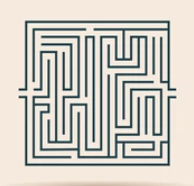
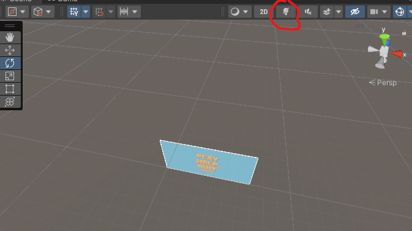

<!--
*** Pour pouvoir lire correctement le readme avec le bon format, vous pouvez vous rendre sur notre repo git avec ce lien : https://github.com/davidcyn974/Laby/
-->

[![Contributors][contributors-shield]][contributors-url]

<!-- PROJECT LOGO -->
 

  

<h3 align="center">Laby</h3>

  

    Projet pour le cours 3DU1
  

<!-- TABLE OF CONTENTS -->

  
Table of Contents

  <ol>
    <li>
      <a href="#A propos du projet">A propos du projet</a>
    </li>
    <li>
      <a href="#Comment commencer">Comment commencer</a>
    </li>
    <li><a href="#Utilisation">Utilisation</a></li>
    <li><a href="#Implémentation des différentes contraintes">Implémentation des différentes contraintes</a>
    <ul>
        <li><a href="#Contraintes principales">Contraintes principales</a></li>
        <li><a href="#Contraintes supplémentaires">Contraintes supplémentaires</a></li>
    </ul>
    </li>
    <li><a href="#Fonctionnalités supplémentaires">Fonctionnalités supplémentaires</a></li>
  </ol>

<!-- ABOUT THE PROJECT -->
## A propos du projet
Pour ce projet, nous avons décidé de réaliser un jeu dans lequel le but est de rejoindre un cube vert en parcourant un labyrinthe.

(<a href="#readme-top">back to top</a>)

<!-- GETTING STARTED -->
## Comment commencer

Pour lancer notre projet, il faut aller dans Assets/Scene et cliquer sur la scène qui a pour nom Menu. C'est le menu principal à partir duquel on peut commencer à jouer. Bien sûr on peut aussi build le projet en allant sur "Build and run".
 
Attention cependant, lorsqu'on arrive sur la scène il faut décocher cette option pour avoir la bonne lumière quand on build le projet: 
 

  Il arrive qu'on ait encore une mauvaise lumière même si on décoche l'option quand on exécute le projet dans unity depuis le menu. Ce bug n'apparait pas quand on build le projet et après des recherches sur internet il semblerait que ce bug soit courant.

(<a href="#readme-top">back to top</a>)

<!-- USAGE EXAMPLES -->
## Utilisation

Lorsque l'on appuie sur play, on arrive sur le menu principal. Dans le sous menu HELP nous avons indiqué comment jouer au jeu et finir la partie. Une fois que la partie est finie, on peut appuyer sur le bouton central et recommencer. On peut aussi appuyer sur echap en cours de partie pour retourner au menu principal.

(<a href="#readme-top">back to top</a>)

<!-- ROADMAP -->
## Implémentation des différentes contraintes

### Contraintes principales

Les 4 principales contraintes pour ce projet étaient: 
- [ ] Petit jeu en 3D
- [ ] Version 2021 de Unity
- [ ] Render Pipeline URP
- [ ] Avoir un player principal se déplaçant dans l'espace

Pour satisfaire ces contraintes, nous avons eu l'idée d'un jeu incluant une résolution de labyrinthe, ou nous prenons le contrôle d'un ballon de basket. On a ensuite converti le projet en URP.

### Contraintes supplémentaires

Voici comment nous avons implémenté les 7 autres contraintes supplémentaires:
- [ ] Système de lighting optimisé
 Nous avons changé la couleur de la lumière, pour faire une impression de lever de soleil. On a augmenté son intensité aussi et changé sa place.
- [ ] Un décor approprié, optimisé
 Nous avons cherché des matériaux relativement jolis pour constituer notre labyrinthe.
 Le terrain a été entièrement dessiné à la main.
 Le labyrinthe a été généré par <a href="https://mazegenerator.net/">mazegenerator.net</a>
- [ ] Des materials
 Nous en avons mis plusieurs, par exemple un material vert pour le cube d'arrivée.
 Certains 'materials' ont été importés comme pour les murs du labyrinthe, mais très peu.
- [ ] Shader
 Un shader graph a été appliqué sur le cube d'arrivée pour le faire "briller" avec une couleur orange.
- [ ] Particle System
 Nous avons mis des particules autour du ballon de basket et du cube.
- [ ] Physique
 Les murs du labyrinthe ne peuvent pas être traversés.
 Nous avons implémenté plusieurs plateformes qui affectent la physique.
 Une de saut (elle est en parquet en bois), une de vitesse.
- [ ] Coroutine
 La plateforme de vitesse change le matériel associé au joueur. Et le fait à la manière d'une animation dans le temps.

(<a href="#readme-top">back to top</a>)

<!-- CONTRIBUTING -->
## Fonctionnalités supplémentaires

Pour une meilleure expérience utilisateur, nous avons ajouté des menus. Le menu principal possède 3 boutons: 
  
- Un bouton "QUIT" qui permet de quitter le jeu (si le projet est build)
- Un bouton "HELP" qui permet l'accès au deuxième menu qui explique les contrôles et le but du jeu
- Un bouton "PLAY" pour jouer au jeu.

(<a href="#readme-top">back to top</a>)
